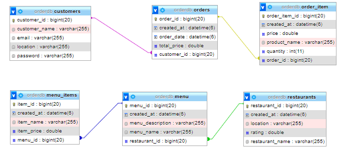

A RESTful API for an online food delivery platform. The API should allow users to browse restaurants, view 
menu items, place orders, and handle order fulfillment

#Backend Developer position at Carrot Institute.

Assignment Description:
Your task is to develop a RESTful API for an online food delivery platform.
The API should allow users to browse restaurants, view menu items, place orders, and handle order fulfillment.
The API should be built using your preferred backend programming language and framework.

Instructions:
a. Data Model:
1. Design a database schema for the food delivery platform,including tables for restaurants, menu items, users,and orders.
2. Define the relationships between the tables (e.g., one-tomany, many-to-many) and ensure referential integrity.

b. API Development:
1. Implement the necessary API endpoints for browsing restaurants, viewing menus, placing orders, and handling order fulfillment.
2. Implement authentication/authorization mechanisms to secure sensitive endpoints.
3. Implement validation and error handling for incoming requests.

c. Documentation:
1. Document the API endpoints, including their usage, expected request/response format, and any required authentication/authorization.
2. Provide clear and concise instructions on how to test the API using tools like Postman or cURL.

Submission:
1. Host your code on a version control platform (e.g., GitHub,GitLab) to showcase your development process.
2. Ensure your code is well-organized, documented, and follows best practices.
3. Provide clear instructions on how to set up and run your API locally.

## Database design:

